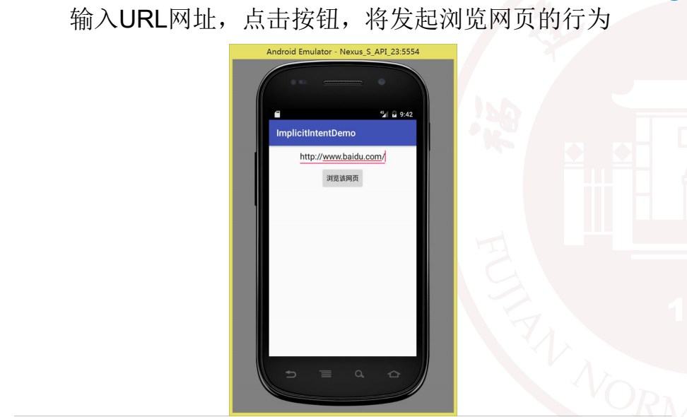
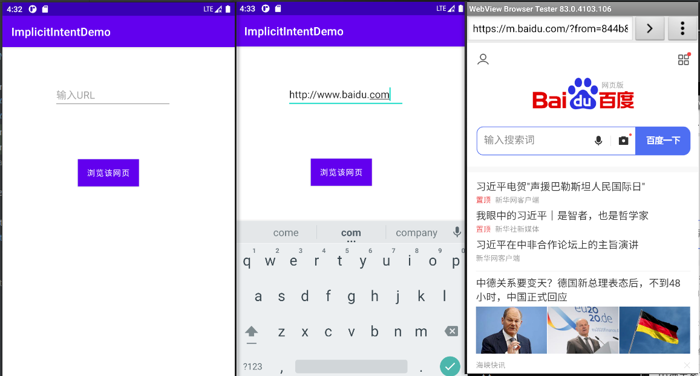
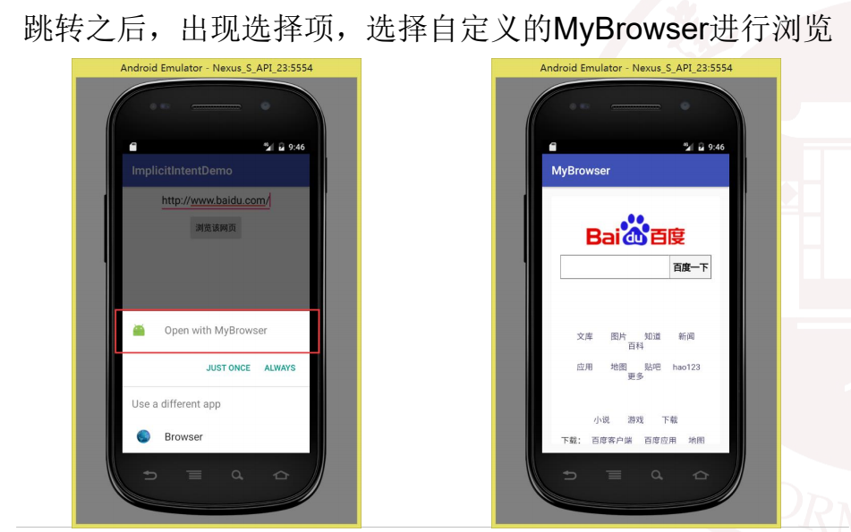
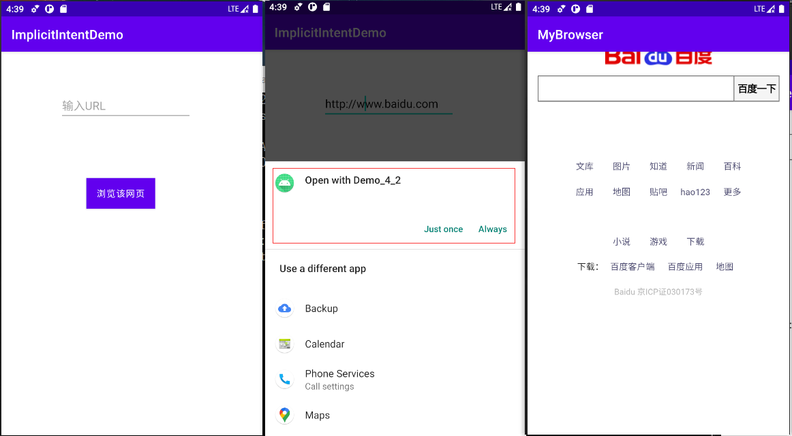

# Android Intent实验

## 自定义WebView验证隐式Intent的使用

**本实验通过自定义WebView加载URL来验证隐式Intent的使用。**
**• 实验包含两个应用（建两个工程）：**
**• 第一个应用：获取URL地址并启动隐式Intent的调用。**
**• 第二个应用：自定义WebView来加载URL**

### ①新建一个工程用来获取URL地址并启动Intent



#### 关键代码

MainActicity.java

```java
package com.example.demo_4_1;

import androidx.appcompat.app.AppCompatActivity;

import android.content.Intent;
import android.net.Uri;
import android.os.Bundle;
import android.view.View;
import android.widget.Button;
import android.widget.EditText;

public class MainActivity extends AppCompatActivity {

    @Override
    protected void onCreate(Bundle savedInstanceState) {
        super.onCreate(savedInstanceState);
        setContentView(R.layout.activity_main);

        setTitle("ImplicitIntentDemo");

        Button btn = (Button) findViewById(R.id.button);
        btn.setOnClickListener(new Button.OnClickListener(){
            @Override
            public void onClick(View v) {
                EditText edit = (EditText) findViewById(R.id.url_test);
                String in_uri = edit.getText().toString();
                Intent intent = new Intent();
                intent.setAction(Intent.ACTION_VIEW);
                intent.setData(Uri.parse(in_uri));
                startActivity(intent);
            }
        });

    }
}
```

activity_main.xml

```xml
<?xml version="1.0" encoding="utf-8"?>
<androidx.constraintlayout.widget.ConstraintLayout xmlns:android="http://schemas.android.com/apk/res/android"
    xmlns:app="http://schemas.android.com/apk/res-auto"
    xmlns:tools="http://schemas.android.com/tools"
    android:layout_width="match_parent"
    android:layout_height="match_parent"
    tools:context=".MainActivity">

    <EditText
        android:id="@+id/url_test"
        android:layout_width="wrap_content"
        android:layout_height="wrap_content"
        android:ems="10"
        android:hint="输入URL"
        android:inputType="textPersonName"
        android:minHeight="48dp"
        app:layout_constraintBottom_toBottomOf="parent"
        app:layout_constraintEnd_toEndOf="parent"
        app:layout_constraintHorizontal_bias="0.452"
        app:layout_constraintStart_toStartOf="parent"
        app:layout_constraintTop_toTopOf="parent"
        app:layout_constraintVertical_bias="0.109" />

    <Button
        android:id="@+id/button"
        android:layout_width="wrap_content"
        android:layout_height="wrap_content"
        android:layout_marginStart="138dp"
        android:layout_marginTop="47dp"
        android:layout_marginEnd="179dp"
        android:background="#CCCCCC"
        android:text="浏览该网页"
        app:layout_constraintBottom_toBottomOf="parent"
        app:layout_constraintEnd_toEndOf="parent"
        app:layout_constraintHorizontal_bias="0.333"
        app:layout_constraintStart_toStartOf="parent"
        app:layout_constraintTop_toTopOf="parent"
        app:layout_constraintVertical_bias="0.298" />
</androidx.constraintlayout.widget.ConstraintLayout>
```

#### 结果截图



### ②新建一个工程使用WebView来加载URL



#### 关键代码

清单文件AndroidManifest.xml

```xml
<activity
    android:name=".MainActivity2"
    android:exported="true" >
    <intent-filter>
        <action android:name="android.intent.action.VIEW" />
        <category android:name="android.intent.category.DEFAULT" />
    </intent-filter>
</activity>
```

MainActicity.java

```java
package com.example.demo_4_2;

import androidx.appcompat.app.AppCompatActivity;

import android.content.Intent;
import android.net.Uri;
import android.os.Bundle;
import android.view.View;
import android.widget.Button;
import android.widget.EditText;

public class MainActivity extends AppCompatActivity {

    @Override
    protected void onCreate(Bundle savedInstanceState) {
        super.onCreate(savedInstanceState);
        setContentView(R.layout.activity_main);

        setTitle("ImplicitIntentDemo");

        Button btn = (Button) findViewById(R.id.button);
        btn.setOnClickListener(new Button.OnClickListener(){
            @Override
            public void onClick(View v) {
                EditText edit = (EditText) findViewById(R.id.url_test);
                String in_uri = edit.getText().toString();
                Intent intent = new Intent();
                intent.setAction(Intent.ACTION_VIEW);
                intent.addCategory(Intent.CATEGORY_DEFAULT);
                startActivity(intent);
            }
        });
    }
}
```

MainActicity2.java

```java
package com.example.demo_4_2;

import androidx.appcompat.app.AppCompatActivity;

import android.content.Intent;
import android.net.Uri;
import android.os.Bundle;
import android.webkit.WebView;
import android.webkit.WebViewClient;

public class MainActivity2 extends AppCompatActivity {

    @Override
    protected void onCreate(Bundle savedInstanceState) {
        super.onCreate(savedInstanceState);
        setContentView(R.layout.activity_main2);
        setTitle("MyBrowser");

        //通过Activity.getIntent()获取当前页面接收到的Intent。
        Intent intent =getIntent();

        //获得控件
        WebView webView = (WebView) findViewById(R.id.webview_test);
        //访问网页
        webView.loadUrl(intent.getStringExtra("uri"));
        //系统默认会通过手机浏览器打开网页，为了能够直接通过WebView显示网页，则必须设置
        webView.setWebViewClient(new WebViewClient(){
            @Override
            public boolean shouldOverrideUrlLoading(WebView view, String url) {
                //使用WebView加载显示url
                view.loadUrl(url);
                //返回true
                return true;
            }
        });


    }
}
```

activity_main2.xml

```xml
<?xml version="1.0" encoding="utf-8"?>
<androidx.constraintlayout.widget.ConstraintLayout xmlns:android="http://schemas.android.com/apk/res/android"
    xmlns:app="http://schemas.android.com/apk/res-auto"
    xmlns:tools="http://schemas.android.com/tools"
    android:layout_width="match_parent"
    android:layout_height="match_parent"
    tools:context=".MainActivity2">

    <WebView
        android:id="@+id/webview_test"
        android:layout_width="409dp"
        android:layout_height="729dp"
        android:layout_marginStart="1dp"
        android:layout_marginTop="1dp"
        android:layout_marginEnd="1dp"
        android:layout_marginBottom="1dp"
        app:layout_constraintBottom_toBottomOf="parent"
        app:layout_constraintEnd_toEndOf="parent"
        app:layout_constraintStart_toStartOf="parent"
        app:layout_constraintTop_toTopOf="parent" />
</androidx.constraintlayout.widget.ConstraintLayout>
```

#### 结果截图

